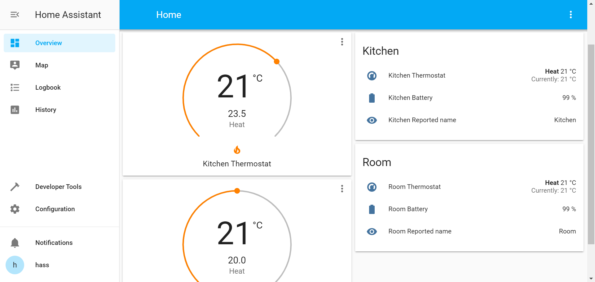
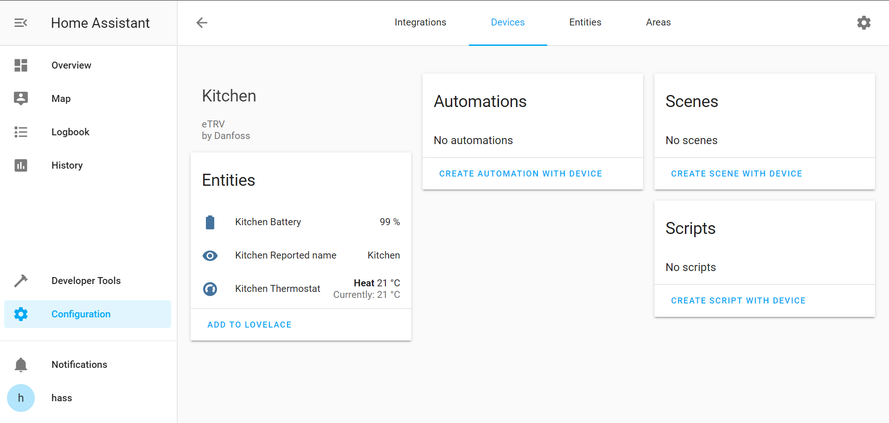

# etrv2mqtt
MQTT bridge for Danfoss eTRV thermostats. Supports MQTT autodiscovery in Home Assistant.



Device links are supported so Home Assistant sees all sensors as a single logical entity


## Installation
```sh
mkdir -p ~/venv/libetrv
virtualenv ~/venv/libetrv
git clone https://github.com/keton/etrv2mqtt.git
cd etrv2mqtt
~/venv/libetrv/bin/pip3 install -r requirements.txt
```

## Configuration

`config.json` example:
```json
{
    "$schema": "https://raw.githubusercontent.com/keton/etrv2mqtt/master/etrv2mqtt/schemas/config.schema.json",
    "mqtt": {
        "base_topic": "etrv",
        "server": "localhost",
        "port": 1883,
        "autodiscovery": true
    },
    "poll_interval": 600,
    "retry_limit": 5,
    "thermostats": [
        {
            "topic": "Room",
            "address": "00:01:02:03:04:05",
            "secret_key": "01020304050607080910111213141516"
        },
        {
            "topic": "Kitchen",
            "address": "02:03:04:03:04:05",
            "secret_key": "11121304050607080910111213141516"
        }
    ]
}
```

## Getting MAC addresses and secret keys
1. Scan for nearby thermostats: `sudo ~/venv/libetrv/bin/python3 -m libetrv.cli scan` 
2. Get secret key for a device: `~/venv/libetrv/bin/python3 -m libetrv.cli device --device-id 01:02:03:04:05:06 retrieve_key`. Push physical button on thermostat when prompted.

## Running
`~/venv/libetrv/bin/python3 etrv2mqtt.cli config.json` 
Configured devices should be automatically added to homeassistant as long as MQTT autodiscovery is enabled.
